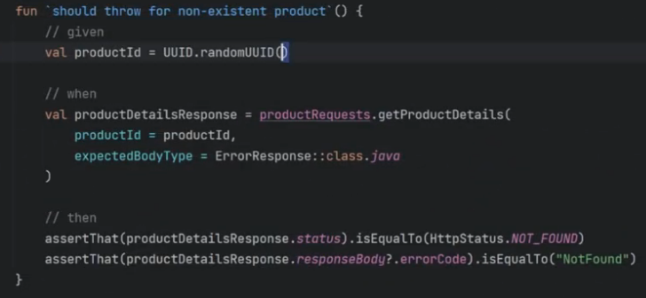
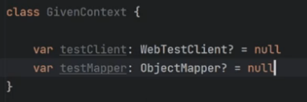
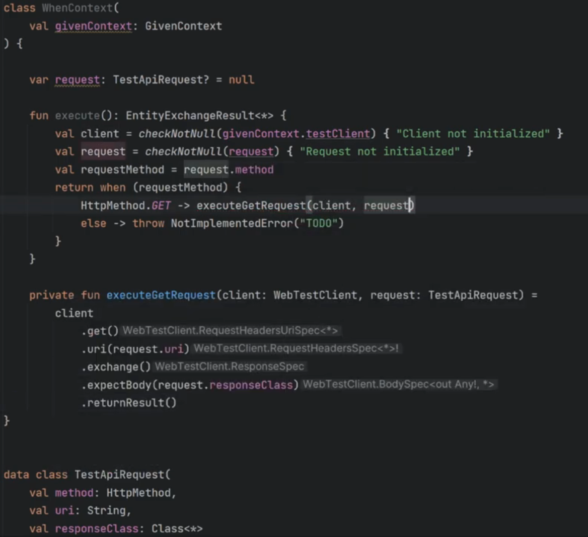
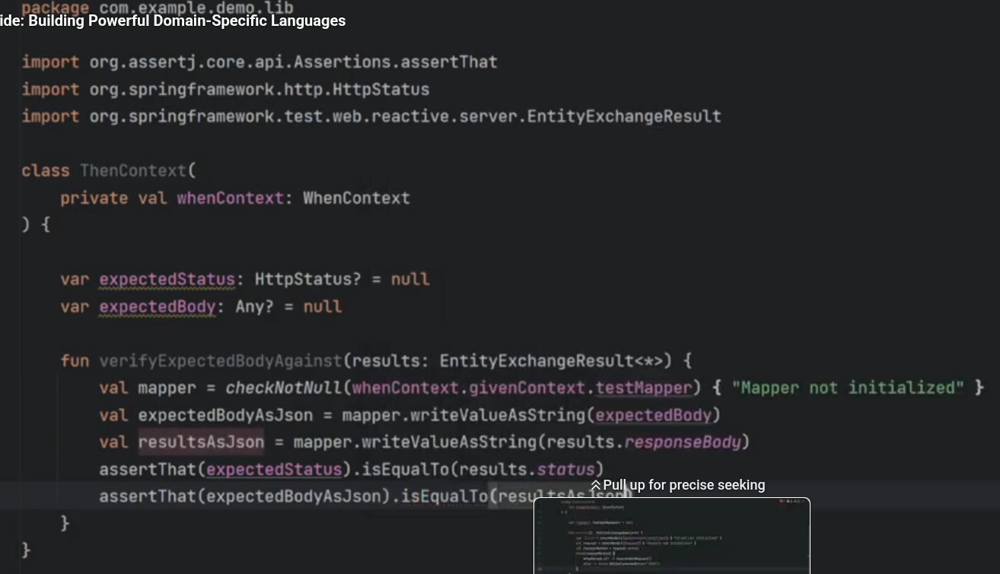
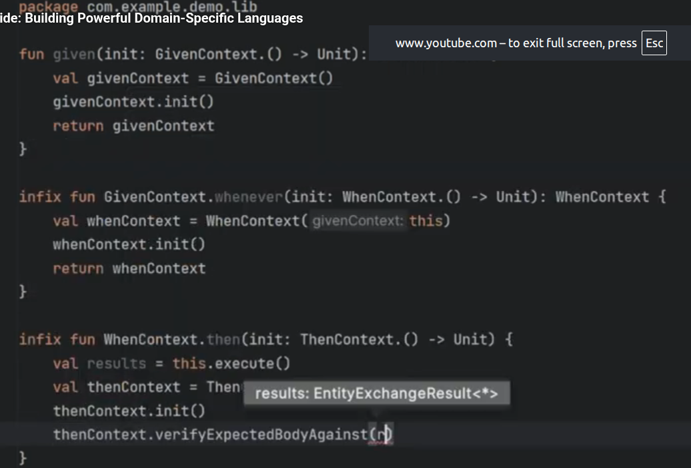
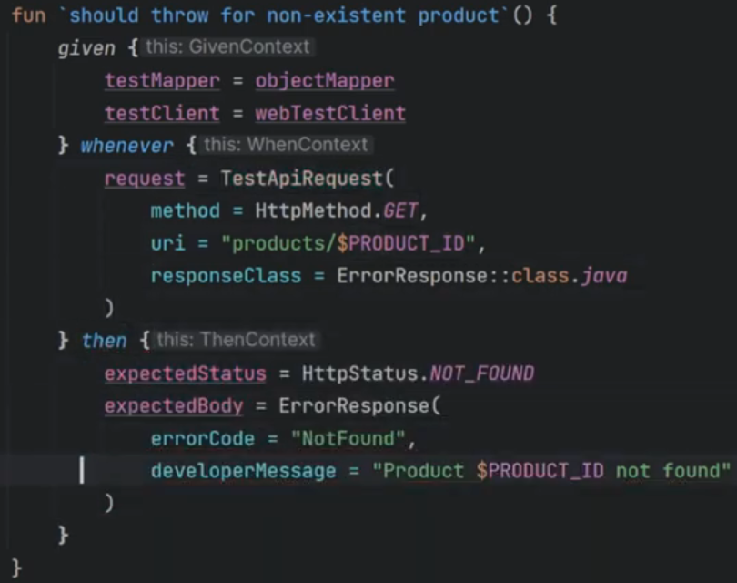

# Kotlin Essentials

## Reference: https://courses.rockthejvm.com/courses/kotlin-essentials/lectures/52301560

## Chapter 1: Variables and Types

    val aBoolean: Boolean = true
    val aChar: Char = 'a'
    val aString: String = "Hello, World!"
    _**val anIntRange: IntRange = 1..10**_
    val aFloat: Float = 1.0f    //4 bytes
    val aDouble: Double = 1.0   // 8 bytes
    val aLong: Long = 1L        // 8 bytes
    val aInt: Int = 1           // 4 bytes
    val aByte: Byte = 1
    val aShort: Short = 1       // 2 bytes

## Chapter 2: Expressions and Instructions

### 2.1: Expressions

    // math expression: + - * / %
    // assignment expression: = += -= *= /= %=
    // comparison expression: < > <= >= == !=
    // logical expression: && || !
    // _**range expression: a..b**_
    // as expression: a as Type 
    // is expression: a is Type 
    // if expression: if (condition) { ... } else { ... }
    // when expression: when (condition) { ... }
    // for expression: for (item in collection) { ... }
    // _**bitwise operations: shl, shr, ushr, and, or, xor, inv**_
    val bitwiseExpression = 2 shl 2 // 1000 = 8
    println("bitwiseExpression = $bitwiseExpression")

### 2.2: Instructions
Instructions are EXECUTED (imperative programming), and expressions are VALUE (functional programming)

    val aCondition = 1 > 2
    // instruction
    if (aCondition) {
        println("aCondition is true")
    } else {
        println("aCondition is false")
    }

    // expression
    val anIfExpression = if (aCondition) "aCondition is true" else "aCondition is false"
    println("anIfExpression = $anIfExpression")

    // when - switch on steroids
    val aNumber = 10
    when (aNumber) {
        1 -> println("aNumber is 1")
        2 -> println("aNumber is 2")
        else -> println("aNumber is something else")
    }
    // when can also be used as an expression
    val aWhenExpression = when (aNumber) {
        1 -> "aNumber is 1"
        2 -> "aNumber is 2"
        else -> "aNumber is something else"
    }
    println("aWhenExpression = $aWhenExpression")

    val anything: Any = 42
    val something = when (anything) {
        is Int -> println("anything is an Int")
        is String -> println("anything is a String")
        else -> println("anything is something else")
    }

## Chapter 3: Loop
    // looping - instructions
    // for loop: NB: "i" is final and immutable inside the for loop
    println("inclusive range")
    for (i in 1..10) {
        println("i = $i")
    }
    println("exclusive range")
    for (i in 1..< 10) {
        println("i = $i")
    }
    println("exclusive range v2")
    for (i in 1 until 10) {
        println("i = $i")
    }
    println("inclusive range, step 2 range")
    for (i in 1..10 step 2) {
        println("i = $i")
    }

    println("descending range")
    for (i in 10 downTo 1) {
        println("i = $i")
    }

    // arrays
    println("iterating over collection")
    val anArray = arrayOf(1, 2, 3, 5, 9, 8, 10, 4, 7, 6)
    for (elem in anArray) {
        println("elem = $elem")
    }

    // while loop
    var i = 1
    while ( i <= 10 ) {
        println("i = $i")
        i++
    }
    
    // do-while
    var j = 10
    do {
        println("j = $j")
        j--
    } while (j > 0)

## Chapter 4: Functions
    // Unit == void
    fun simpleFunction(arg: String): Unit {
    println("Just passed an argument: $arg")    // string template or interpolation
    }
    
    fun printHello() {
    println("Hello World! - no-arg function")
    }
    
    // concatenate a string count times
    fun concatenate(str1: String, count: Int): String {
    val list = mutableListOf<String>()
    for (i in 1..count) {
    list.add(str1)
    }
    
        return list.joinToString(" ")
    }
    
    // special syntax for single expression functions
    fun combineStrings(strA: String, strB: String): String = "$strA--$strB"
    
    // recursive function to combine strings
    fun combineStringsRecursive(strA: String, strB: String): String =
    if (strB.isEmpty()) strA else combineStringsRecursive(strA + strB.first(), strB.drop(1))
    
    fun concatenateRecursive(str1: String, count: Int): String =
    if (count == 0) "" else if (count == 1) str1 else str1 + concatenateRecursive(str1, count - 1)
    
    //recursion
    fun factorial(n: Long): Long = if (n <= 1) 1 else n * factorial(n - 1)
    
    // default args
    fun demoDefaultArgs(a: Int = 0, b: String = "") {
    println("a = $a, b = $b")
    }
    
    fun complexFunction(outerArg: String) {
    // very complex logic
    fun innerFunction(innerArg: Int) {
    println("Outer arg: $outerArg, inner arg: $innerArg")
    }
    
        innerFunction(10)
    }

* Exercises:
*  1. greeting function (name, age) -> "Hi, my name is $name, I'm $age years old"
*  2. factorial function (n) -> n!
*  3. fibonacci function (n) -> fib(n) = fib(n-1) + fib(n-2)
*  4. reverse string function
*  5. isPalindrome function
*  6. isPermutation function
*  7. isSubstring function
*  8. isAnagram function
*  9. isPalindromeRecursive function
*  10. isPermutationRecursive function

    fun greeting(name: String, age: Int) = "Hi, my name is $name, I'm $age years old"

    fun fibonacci(n: Int): Int = if (n == 1) 1 else if (n == 2) 2 else fibonacci(n - 1) + fibonacci(n - 2)

    fun reverseString(str: String): String = str.reversed()
    
    fun isPalindrome(str: String): Boolean = str == reverseString(str)
    
    fun isPermutation(strA: String, strB: String): Boolean = strA.toList().sorted() == strB.toList().sorted()
    
    fun isSubstring(str: String, subStr: String): Boolean = str.contains(subStr)
    
    fun isAnagram(strA: String, strB: String): Boolean = strA.toList().sorted() == strB.toList().sorted() && strA.length == strB.length
    
    fun isPrime(n: Int): Boolean = (2..n / 2).none { n % it == 0 }

## Chapter 5: Class delegation
    package com.gary.com.gary.basics

    interface Base {
    fun print()
    }
    
    class BaseImpl(val x: Int) : Base {
    override fun print() { print("This is Base implementation: $x") }
    }
    
    class Derived(b: Base) : Base by b
    
    // Why using class delegation?
    // 1. Avoid code duplication
    // 2. Encapsulate implementation
    // 3. Be able to override only a subset of the behavior
    // 4. Alternative to inheritance
    
    interface Repository {
    fun getAll(): List<String>
    fun getById(id: Int): String?
    }
    
    class DatabaseRepository : Repository {
    override fun getAll(): List<String> {
    return listOf("Item 1", "Item 2", "Item 3")
    }
    override fun getById(id: Int): String? = if (id == 1) "Item 1" else null
    }
    
    class CachedRepository(private val repository: Repository) : Repository by repository {
    private val cache = mutableMapOf<Int, String?>()
    
        override fun getById(id: Int): String? {
            return cache.getOrPut(id) {
                repository.getById(id)
            }
        }
    }
    
    // Decorator Pattern
    interface TextProcessor {
    fun process(text: String): String
    }
    
    class BasicTextProcessor : TextProcessor {
    override fun process(text: String): String = text.trim()
    }
    
    class CapitalizingProcessor(private val textProcessor: TextProcessor) : TextProcessor by textProcessor {
    override fun process(text: String): String = textProcessor.process(text).uppercase()
    }
    
    class ReversingProcessor(private val textProcessor: TextProcessor) : TextProcessor by textProcessor {
    override fun process(text: String): String = textProcessor.process(text).reversed()
    }
    
    // Property delegation with custom logic
    interface UserService {
    fun getUser(id: Int): String?
    fun saveUser(id: Int, user: String)
    }
    
    class DefaultUserService : UserService {
    private val users = mutableMapOf<Int, String>()
    override fun getUser(id: Int): String? = users[id]
    override fun saveUser(id: Int, name: String) {
    users[id] = name
    println("User Id:$id saved as $name")
    }
    }
    
    class LoggingUserService(private val userService: UserService) : UserService by userService {
    override fun getUser(id: Int): String? {
    println("Getting user $id")
    val result = userService.getUser(id)
    println("Result $result")
    return result
    }
    
        override fun saveUser(id: Int, name: String) {
            println("Saving user $id")
            userService.saveUser(id, name)
            println("Saved user $id")
        }
    }
    
    // Combining multiple delegates
    interface Reader {
    fun read(): String
    }
    
    interface Writer {
    fun write(text: String)
    }
    
    class FileReader : Reader {
    override fun read(): String = "File content"
    }
    
    class ConsoleWriter : Writer {
    override fun write(text: String) = println("Writing: $text in console")
    }
    
    class ReadWriterService(reader: Reader, writer: Writer) : Reader by reader, Writer by writer {
    fun copy() {
    val content = read()
    write(content)
    }
    }
    
    // Delegate with custom scope
    interface DataSource {
    fun fetchData(): List<String>
    }
    
    class NetworkDataSource : DataSource {
    override fun fetchData(): List<String> {
    println("Fetching data from network...")
    return listOf("Network Item 1", "Network Item 2", "Network Item 3")
    }
    }
    
    class CachedDataSource(private val dataSource: DataSource) : DataSource by dataSource {
    private var cachedData: List<String>? = null
    
        override fun fetchData(): List<String> {
            if (cachedData == null) {
                println("Cached data is empty, fetching data from network...")
                return dataSource.fetchData()
            }
    
            return cachedData!!
        }
    
        fun clearCache() {
            cachedData = null
            println("Cache cleared")
        }
    }
    
    // Delegate with lazy initialization
    class LazyCachedDataSource(dataSource: () -> DataSource) : DataSource by lazy(dataSource).value
    
    
    fun main() {
    val b = BaseImpl(10)
    Derived(b).print()
    
        val dbRepo = DatabaseRepository()
        val cachedRepo = CachedRepository(dbRepo)
    
        println(cachedRepo.getAll()) // Delegated to DatabaseRepository
        println(cachedRepo.getById(1)) // Uses cache + delegation
    
        val basicTextProcessor = BasicTextProcessor()
        println(CapitalizingProcessor(basicTextProcessor).process("  hello  "))
        println(ReversingProcessor(basicTextProcessor).process("  hello  "))
    
        val userService = DefaultUserService()
        val loggingUserService = LoggingUserService(userService)
        loggingUserService.saveUser(1, "Gary")
        loggingUserService.getUser(1)
        loggingUserService.saveUser(2, "Carol")
    
        val reader = FileReader()
        val writer = ConsoleWriter()
        ReadWriterService(reader, writer).copy()
    
    }

## Chapter 6: Kotlin DSL

### What is DSL?
Domain Specific Language (DSL) is a language designed to be used in a specific context to solve a specific problem.
DSL is often used to define data structures or configurations in a more declarative and concise way than using standard code.

### Why Kotlin DSL?
Kotlin DSL is a way to create DSLs in Kotlin, and Kotlin DSL is a powerful feature that allows you to create domain-specific
languages using Kotlin's language features like lambda expressions with receivers, extension functions, and infix notation.

An example of DSL for testing:

Before using DSL, the testing code looks like this:

After using DSL, the testing code looks like this:

