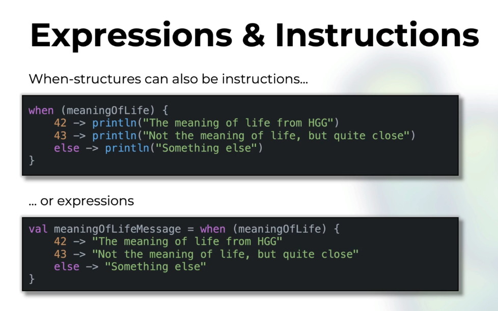

# Kotlin Essentials

## Reference: https://courses.rockthejvm.com/courses/kotlin-essentials/lectures/52301560

## Chapter 1: Variables and Types

    val aBoolean: Boolean = true
    val aChar: Char = 'a'
    val aString: String = "Hello, World!"
    _**val anIntRange: IntRange = 1..10**_
    val aFloat: Float = 1.0f    //4 bytes
    val aDouble: Double = 1.0   // 8 bytes
    val aLong: Long = 1L        // 8 bytes
    val aInt: Int = 1           // 4 bytes
    val aByte: Byte = 1
    val aShort: Short = 1       // 2 bytes

## Chapter 2: Expressions and Instructions

### 2.1: Expressions

    // math expression: + - * / %
    // assignment expression: = += -= *= /= %=
    // comparison expression: < > <= >= == !=
    // logical expression: && || !
    // _**range expression: a..b**_
    // as expression: a as Type 
    // is expression: a is Type 
    // if expression: if (condition) { ... } else { ... }
    // when expression: when (condition) { ... }
    // for expression: for (item in collection) { ... }
    // _**bitwise operations: shl, shr, ushr, and, or, xor, inv**_
    val bitwiseExpression = 2 shl 2 // 1000 = 8
    println("bitwiseExpression = $bitwiseExpression")

### 2.2: Instructions
Instructions are EXECUTED (imperative programming), and expressions are VALUE (functional programming)

    val aCondition = 1 > 2
    // instruction
    if (aCondition) {
        println("aCondition is true")
    } else {
        println("aCondition is false")
    }

    // expression
    val anIfExpression = if (aCondition) "aCondition is true" else "aCondition is false"
    println("anIfExpression = $anIfExpression")

    // when - switch on steroids
    val aNumber = 10
    when (aNumber) {
        1 -> println("aNumber is 1")
        2 -> println("aNumber is 2")
        else -> println("aNumber is something else")
    }
    // when can also be used as an expression
    val aWhenExpression = when (aNumber) {
        1 -> "aNumber is 1"
        2 -> "aNumber is 2"
        else -> "aNumber is something else"
    }
    println("aWhenExpression = $aWhenExpression")

    val anything: Any = 42
    val something = when (anything) {
        is Int -> println("anything is an Int")
        is String -> println("anything is a String")
        else -> println("anything is something else")
    }

## Chapter 3: Loop
    // looping - instructions
    // for loop: NB: "i" is final and immutable inside the for loop
    println("inclusive range")
    for (i in 1..10) {
        println("i = $i")
    }
    println("exclusive range")
    for (i in 1..< 10) {
        println("i = $i")
    }
    println("exclusive range v2")
    for (i in 1 until 10) {
        println("i = $i")
    }
    println("inclusive range, step 2 range")
    for (i in 1..10 step 2) {
        println("i = $i")
    }

    println("descending range")
    for (i in 10 downTo 1) {
        println("i = $i")
    }

    // arrays
    println("iterating over collection")
    val anArray = arrayOf(1, 2, 3, 5, 9, 8, 10, 4, 7, 6)
    for (elem in anArray) {
        println("elem = $elem")
    }

    // while loop
    var i = 1
    while ( i <= 10 ) {
        println("i = $i")
        i++
    }
    
    // do-while
    var j = 10
    do {
        println("j = $j")
        j--
    } while (j > 0)

## Chapter 4: Functions
    // Unit == void
    fun simpleFunction(arg: String): Unit {
    println("Just passed an argument: $arg")    // string template or interpolation
    }
    
    fun printHello() {
    println("Hello World! - no-arg function")
    }
    
    // concatenate a string count times
    fun concatenate(str1: String, count: Int): String {
    val list = mutableListOf<String>()
    for (i in 1..count) {
    list.add(str1)
    }
    
        return list.joinToString(" ")
    }
    
    // special syntax for single expression functions
    fun combineStrings(strA: String, strB: String): String = "$strA--$strB"
    
    // recursive function to combine strings
    fun combineStringsRecursive(strA: String, strB: String): String =
    if (strB.isEmpty()) strA else combineStringsRecursive(strA + strB.first(), strB.drop(1))
    
    fun concatenateRecursive(str1: String, count: Int): String =
    if (count == 0) "" else if (count == 1) str1 else str1 + concatenateRecursive(str1, count - 1)
    
    //recursion
    fun factorial(n: Long): Long = if (n <= 1) 1 else n * factorial(n - 1)
    
    // default args
    fun demoDefaultArgs(a: Int = 0, b: String = "") {
    println("a = $a, b = $b")
    }
    
    fun complexFunction(outerArg: String) {
    // very complex logic
    fun innerFunction(innerArg: Int) {
    println("Outer arg: $outerArg, inner arg: $innerArg")
    }
    
        innerFunction(10)
    }

